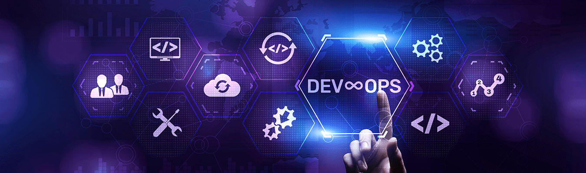

<!-- Banner Section -->

  

<h1 align="center">Hi 👋, I'm Fuzail Ahamad</h1>
<h3 align="center">🚀 Aspiring DevOps & Cloud Engineer | AWS Certified | Linux Enthusiast</h3>

  

---

- 🔭 I’m currently working on **CI/CD Pipelines with Jenkins & Docker**
- 🌱 I’m currently learning **Kubernetes** & **Terraform**
- 👯 I’m looking to collaborate on **Cloud & DevOps projects**
- 💬 Ask me about **AWS, Linux, Docker, Jenkins**
- 📫 Reach me at **fuzailahmad672@gmail.com**
- 📄 [My Resume] (https://drive.google.com/file/d/13thb-vTDi_Y9K4MLBfrJZTLre41-a-Mf/view?usp=sharing)

---

### 🧰 Languages & Tools:

  
  
  
  
  
  
  
  
  
  
  

---

### 📊 GitHub Stats

  
  

---

### 🏆 Certifications
- ✅ AWS Certified Cloud Practitioner  
- 🥈 NPTEL – Cloud Computing & Distributed Systems *(Silver Medal)*  
- 📘 NPTEL – Database Management Systems  
📂 [All Certificates](https://drive.google.com/drive/folders/1oKrCrIm7nKy2GsD2Zz48asVrRouz09nK?usp=sharing)

---

### 🔗 Connect With Me

  
  
  

---

💡 *“Passionate about building cloud-native, scalable, and resilient systems through DevOps excellence.”*

⭐ _Looking for DevOps/Cloud Engineer Internships or Entry-level Roles_
